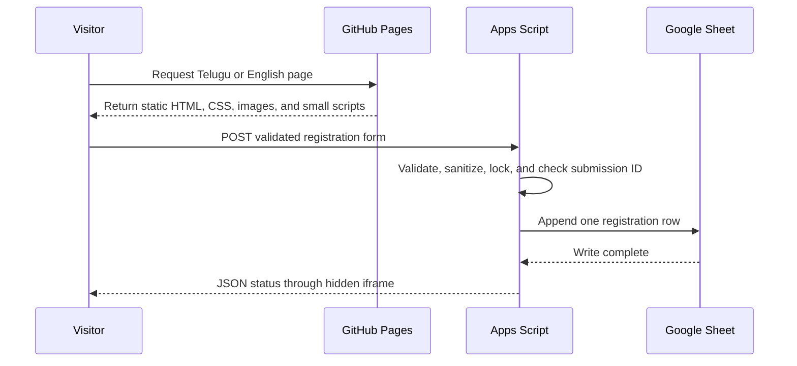
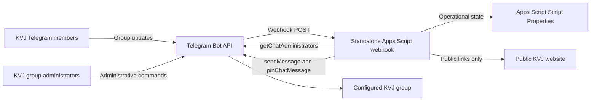
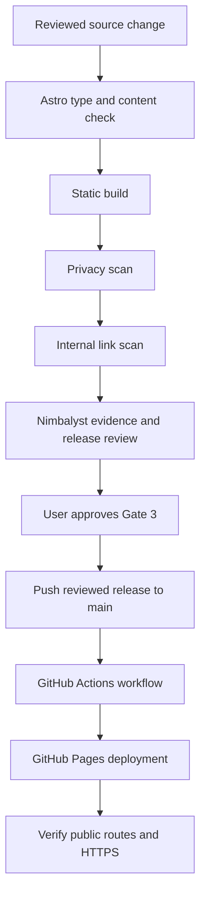

# KVJ Satsangam master specification

Version: 1.2

Last updated: 2026-09-19

Status: Website live. Post-launch Telegram operations bot active.

## 1. Purpose

Krishnam Vande Jagadgurum is a bilingual public website for a Hyderabad-based Telugu devotional learning community. It explains the community and its programs, presents the teacher, provides approved community media and learning summaries, and gives prospective participants a private registration path.

The site must remain simple to operate, inexpensive to host, respectful of participant privacy, and safe for nontechnical content maintenance.

## 2. Source of truth

| Concern | Canonical source |
| --- | --- |
| Agent workflow and safeguards | `CLAUDE.md` |
| Product and technical specification | `docs/MASTER_SPEC.md` |
| Durable decisions and rationale | `docs/DECISIONS.md` |
| Delivery scope and gates | `plan.md` in Nimbalyst Plan |
| Current execution state and evidence | Nimbalyst Tracker |
| Maintainer commands | `README.md` |
| Public implementation | `src/` and `public/` |
| Registration backend source | `scripts/google-apps-script/Code.gs` |
| Deployed registration endpoint | `src/data/registration.ts` |
| Telegram bot source and operations | `scripts/telegram-bot/` |
| Telegram discovery evidence | `research/telegram-group-findings.md` |

The user's latest explicit instruction overrides all repository documents. Nimbalyst is authoritative for approvals and active work state.

## 3. Product scope

### 3.1 Audiences

- Telugu-speaking learners seeking devotional scripture study
- English-speaking visitors evaluating the community
- Existing participants looking for program and participation context
- Organizers reviewing registrations in Google Sheets
- Maintainers updating approved content through the repository

### 3.2 Public routes

| Experience | Telugu | English | Purpose |
| --- | --- | --- | --- |
| Home | `/` | `/en/` | Identity, mission, program summary, and primary action |
| Programs | `/programs/` | `/en/programs/` | Published study programs and current stage |
| About | `/about/` | `/en/about/` | Teacher and community profile |
| Classes | `/classes/` | `/en/classes/` | Class platform, schedule policy, and participation model |
| Gallery | `/gallery/` | `/en/gallery/` | Approved community and devotional imagery |
| Resources | `/resources/` | `/en/resources/` | Approved learning summaries and availability |
| Join | `/join/` | `/en/join/` | Private organizer-coordinated participation path |
| Register | `/register/` | `/en/register/` | Private interest registration |
| Error page | `/404.html` | Shared | Recovery and navigation |

### 3.3 Explicitly excluded from the current release

- CMS or headless content service
- Supabase or another application database
- member accounts or authentication
- attendance tracking or membership cards
- donations or payment processing
- automated Telegram invitations or message archival
- private resource access
- cookie-based analytics
- an organizer admin dashboard

Reconsider an excluded capability only through a new Nimbalyst tracker item and an updated decision record.

## 4. Technology choices

| Layer | Choice | Why it fits | Operating consequence |
| --- | --- | --- | --- |
| Web framework | Astro 7.3.3 | Content-first static delivery with small client scripts | Pages are generated at build time |
| Language | TypeScript 6 with Astro strict config | Compile-time checks for data and components | `npm run check` is required |
| Content | Astro Content Collections with Zod schemas | Structured bilingual content with build-time validation | Invalid entries stop the build |
| Site data | YAML loaded through Astro collections | Maintainer-friendly identity and schedule updates | Values remain schema-checked |
| Styling | Repository CSS in `src/styles/global.css` | Small site, shared design tokens, no UI framework overhead | Visual changes require manual responsive review |
| Hosting | GitHub Pages | Static hosting aligned to the source workflow | Repository base paths must be supported |
| Continuous delivery | GitHub Actions | Reproducible validation and artifact-only publication | Gate 3 must precede public deployment |
| Registration | Google Apps Script web app | Adds controlled write behavior to an organizer-owned Sheet | Backend changes require versioned deployment |
| Data store | Google Sheet `KVJ_Registrations`, tab `Sheet1` | Familiar organizer workflow and no separate admin interface | Appropriate only for current registration volume |
| Telegram operations | Standalone Google Apps Script web app with Telegram webhook delivery | Near-real-time operations without adding a website server | Script Properties hold secrets and operational state |
| Project control | Nimbalyst Plan and Tracker | Cross-session work state, evidence, dependencies, and human approval | Tracker evidence must stay current |

The project intentionally avoids a public server runtime, JavaScript framework hydration, and a separate database.

## 5. System architecture

```mermaid
flowchart LR
    Visitor[Visitor browser]
    Maintainer[Maintainer]
    Agent[Coding agent]
    Repo[Private source repository]
    Actions[GitHub Actions]
    Build[Astro static build]
    Checks[Type, privacy, and link checks]
    Pages[GitHub Pages public site]
    Form[Registration form]
    Script[Bound Google Apps Script web app]
    Sheet[Organizer Google Sheet, Sheet1]
    NPlan[Nimbalyst Plan]
    NTracker[Nimbalyst Tracker]
    Gate[Human Gate 3 approval]

    Maintainer --> Repo
    Agent --> Repo
    NPlan --> Agent
    NTracker --> Agent
    Agent --> NTracker
    Repo --> Actions
    Actions --> Build
    Build --> Checks
    Checks --> Gate
    Gate --> Pages
    Visitor --> Pages
    Pages --> Form
    Form --> Script
    Script --> Sheet
```



### 5.1 Public runtime



The public site never reads registration rows. Organizers use the Google Sheet directly.

### 5.2 Telegram operations runtime



The bot uses display name `KVJ Satsanga Mitra` and username `KVJ_MitraBot`. This identity remains internal to Telegram operations and internal documentation. It must not appear on the public website.

The webhook accepts member commands in the configured group and private administrative commands only from current group administrators. Telegram privacy mode is disabled so the bot receives the latest group updates. The handler records only the latest group activity timestamp for ordinary messages, then discards their content. It stores no message text, history, member profiles, names, phone numbers, or invite links.

The approved group disables text messages for regular members. The bot therefore requires administrator status with `Pin Messages` as its only selectable administrator right. Telegram displays `Change Group Info` as inherited from the group's member permissions and disables its switch in the bot editor. The bot code does not call group-edit APIs. This role permits operational replies and silent pinning of organizer-approved class notices. It does not authorize moderation, deletion, member management, invitations, stories, video chats, welcome messages, or group editing.

Operational state uses Script Properties. The bot token, group identifier, webhook URL, and webhook secret never enter the repository. `LockService` prevents concurrent handlers, `LAST_UPDATE_ID` provides idempotency, reminders are limited to 25, and automated welcome messages remain disabled until the organizer explicitly enables them. Every bot message starts with `జై శ్రీ మన్నారాయణ🙏🙏` and ends with the bold signature `కృష్ణం వందే జగద్గురుం 🪷🪄📖`.

## 6. Repository architecture

```text
kvj-satsang/
  AGENTS.md                 # Symlink to CLAUDE.md
  CLAUDE.md                 # Canonical agent guide
  README.md                 # Maintainer operations
  plan.md                   # Nimbalyst Plan and release gates
  docs/
    INDEX.md                # Documentation map
    MASTER_SPEC.md          # This specification
    DECISIONS.md            # Durable decision log
  content/                  # Internal working briefs, never published
  research/                 # Internal research, never published
  src/
    assets/                 # Imported, approved source assets
    components/             # Shared Astro UI and registration component
    content/                # Validated public Markdown collections
    data/                   # Site YAML, schedule YAML, copy, and endpoint
    layouts/                # Metadata and page shell
    lib/                    # Base-path URL utilities
    pages/                  # Static route generation and system routes
    styles/                 # Design tokens and responsive styles
  public/                   # Approved files copied directly to output
  scripts/
    check-dist.mjs          # Publication privacy check
    check-links.mjs         # Internal link and asset check
    google-apps-script/
      Code.gs               # Maintained backend source
    telegram-bot/
      Code.gs               # Maintained Telegram operations source
      appsscript.json        # Standalone Apps Script manifest
      test.mjs              # Local bot behavior harness
      README.md             # Deployment and recovery runbook
  .github/workflows/
    deploy.yml              # GitHub Pages pipeline
```

## 7. Content model

The schemas in `src/content.config.ts` are authoritative.

### 7.1 Programs

Location: `src/content/programs/{locale}/`

Required fields:

- `title`
- `description`
- `locale`: `te` or `en`
- `order`: positive integer
- `format`
- `currentStage`
- `published`

### 7.2 Resources

Location: `src/content/resources/{locale}/`

Required fields:

- `title`
- `description`
- `locale`
- `type`
- `availability`: `available` or `review`
- optional `url`
- `published`

### 7.3 Gallery metadata

Location: `src/content/gallery/{locale}/`

Required fields:

- `title`
- `caption`
- `locale`
- `image`
- `alt`
- `credit`
- `creditUrl`
- `published`

The organizer-approved community gallery files live under `public/gallery/community/`. Keep exact duplicates out of the published set and remove embedded metadata before publication.

### 7.4 Site settings and schedule

- `src/data/site.yaml` holds one validated identity record per locale.
- `src/data/schedule.yaml` states that organizers announce schedules in Telegram.
- The time zone is fixed to `Asia/Kolkata`.
- Do not publish guessed times or convert an unconfirmed Telegram announcement into a public schedule.

## 8. Page and component model

- `src/pages/index.astro` and `src/pages/en/index.astro` render localized homepages.
- `src/pages/[...path].astro` generates paired Telugu and English interior routes.
- `src/components/InteriorPage.astro` selects content and renders shared page structures.
- `src/components/SiteHeader.astro` and `SiteFooter.astro` provide navigation and language switching.
- `src/components/RegistrationPanel.astro` owns the bilingual registration form and client submission state.
- `src/data/interior-copy.ts` owns localized interface copy for interior pages.
- `src/lib/urls.ts` owns base-path-safe URL construction.
- `src/layouts/BaseLayout.astro` owns canonical metadata, alternates, social metadata, and the page shell.

New interior pages should follow the existing route registry and localized copy model unless a different structure has a clear reason and an approved decision.

## 9. Registration specification

### 9.1 Front-end fields

| Field name | Required | Constraint | Sheet column |
| --- | --- | --- | --- |
| `fullName` | Yes | 100 characters | Full Name |
| `mobile` | Yes | 8 to 30 permitted telephone characters | Mobile Number |
| `email` | No | Valid email, 150 characters | Email |
| `city` | Yes | 100 characters | City |
| `language` | Yes | Supported option | Preferred Language |
| `program` | Yes | Supported option | Program Interest |
| `background` | No | 500 characters | Learning Background |
| `consent` | Yes | Must equal `yes` | Consent |
| `website` | Hidden | Bot trap, must be empty | Not stored |
| `submissionId` | Generated | Maximum 64 characters | Submission ID |

The backend also writes Submitted At, Source, and Status.

### 9.2 Backend behavior

The bound Apps Script source is `scripts/google-apps-script/Code.gs`.

1. `doGet` returns `{"status":"ready"}` for deployment checks.
2. `doPost` reads form parameters.
3. A populated `website` field exits without a write.
4. Required fields and consent are validated again on the server.
5. Values are trimmed, length-limited, and protected against spreadsheet formula injection.
6. A script lock serializes concurrent writes.
7. The most recent 250 submission IDs are checked for duplicates.
8. A valid new registration is appended to `Sheet1` with source `Website` and status `New`.
9. The service returns `ok`, `duplicate`, `invalid`, or `error` as JSON.

The script uses `@OnlyCurrentDoc` and the active bound spreadsheet. Do not replace it with an arbitrary spreadsheet lookup or broaden OAuth scope without review.

### 9.3 Browser submission behavior

The static form posts to a hidden iframe to avoid a cross-origin fetch dependency. The UI generates a submission ID, disables the submit button, waits for iframe load, resets on success, and exposes status through an `aria-live` region. A 15-second timeout restores the button and displays an error state.

The current success signal proves the endpoint loaded, but it does not parse the returned status in the page. Backend verification and labeled test submissions remain required after backend changes.

### 9.4 Data handling policy

- The website does not display stored registrations.
- The repository contains no spreadsheet credentials.
- Organizer access is managed in Google Sheets.
- The public page collects no payment.
- Retention and deletion are organizer responsibilities until a formal policy is approved.
- Test registrations must be clearly labeled and may be removed by the organizer.

## 10. Privacy and security controls

| Control | Implementation |
| --- | --- |
| Static public surface | Astro static output with no public application server |
| Internal-file boundary | `scripts/check-dist.mjs` scans paths and text in `dist/` |
| Link integrity | `scripts/check-links.mjs` resolves internal `href` and `src` targets |
| Content validation | Astro Content Collections and Zod schemas |
| Form validation | Browser constraints plus Apps Script server checks |
| Bot friction | Invisible honeypot field |
| Formula protection | Prefix values beginning with formula trigger characters |
| Duplicate protection | Client submission ID plus recent-ID backend check |
| Concurrent writes | Apps Script lock with 15-second wait |
| Spreadsheet scope | Bound script with `@OnlyCurrentDoc` |
| Public contact policy | No Telegram or organizer contact details published |

Do not log form bodies, Sheet rows, or personal data during debugging. Use synthetic labeled values for tests.

## 11. Internationalization and accessibility

- The Astro default locale is `te`; English is `en`.
- Each page supplies canonical and alternate-language metadata.
- The interface uses semantic landmarks, labels, keyboard-visible controls, alternative text, and live form status.
- Decorative images use empty alternative text or `aria-hidden` where appropriate.
- New motion must respect reduced-motion preferences.
- Maintain readable contrast across the midnight navy, temple gold, peacock green, ivory, and lotus pink design system.
- Validate both locales after copy, navigation, metadata, or layout changes.

## 12. Build and deployment

### 12.1 Local validation

```bash
npm run check
npm run build
```

`npm run build` performs three required stages:

1. Astro static build
2. private-material scan of `dist/`
3. internal link and asset verification

### 12.2 GitHub Pages validation

```bash
env GITHUB_REPOSITORY=m0k0ut/kvj-satsang SITE_URL=https://m0k0ut.github.io npm run build
```

This simulates the repository base path. Run it after changes to routing, navigation, canonical URLs, public assets, or deployment configuration.

### 12.3 Deployment pipeline



The workflow in `.github/workflows/deploy.yml` runs on pushes to `main` and manual dispatch. It uses Node 24, runs the check and build commands, uploads the generated artifact, and deploys it to GitHub Pages.

### 12.4 Release gate

Gate 3 is a human approval in Nimbalyst. Agents may prepare evidence and a release candidate, but they must not approve the gate or publish the site without an explicit user instruction.

## 13. Nimbalyst workflow

### 13.1 Control model

- `plan.md` is the single Nimbalyst Plan.
- Tracker items represent the numbered work items and approval gates.
- Dependencies determine readiness.
- Comments hold file, test, privacy, and preview evidence.
- Gate 2 and Gate 3 use `#approval-required` and remain `in-review` or `to-do` until human action.

### 13.2 Relevant work items

| Work item | Use for |
| --- | --- |
| Work item 3 | Visual system and meaningful preview evidence |
| Gate 2 | Human visual-direction review |
| Work item 4 | Public page and registration implementation evidence |
| Work item 5 | Content, biography, media, and publication-right evidence |
| Work item 6 | Type, build, accessibility, privacy, link, and integration evidence |
| Gate 3 | Human launch approval |
| Work item 7 | GitHub Pages publication and public verification |
| Work item 8 | Maintenance and handoff documentation |

### 13.3 Evidence format

Tracker evidence should state:

- outcome
- changed file paths
- checks run and exact result
- integration or preview evidence
- remaining blocker or approval

Prefer tracker comments for evidence. Do not claim a shared tracker description unless Nimbalyst confirms collaborative body storage.

## 14. Validation matrix

| Change type | Minimum validation |
| --- | --- |
| Markdown or YAML content | `npm run check`, `npm run build`, both locales reviewed |
| Components, routes, metadata, or CSS | `npm run check`, normal build, project-page build, responsive review |
| Public images | Permission confirmation, metadata removal, alt text, both builds |
| Navigation or URL helper | Project-page build and direct-route review |
| Registration front end | Both builds, required-field behavior, keyboard and live-status review |
| Apps Script backend | Syntax check, new deployment version, readiness GET, labeled Sheet test, duplicate retry |
| Telegram bot | `npm run test:telegram-bot`, syntax check, Script Properties review, trigger review, labeled group tests |
| Deployment workflow | Workflow syntax review, Gate 3 confirmation, public URL and route verification |
| Documentation | Reference check, prohibited-dash scan, Nimbalyst evidence |

## 15. Current verified state

As of 2026-09-19:

- Telugu and English registration routes are implemented.
- The Apps Script web app is deployed with public form access and current-document scope.
- A labeled test row reached `Sheet1`.
- Reusing the same submission ID returned `duplicate`.
- Astro type checks pass with no errors, warnings, or hints.
- The production build creates 17 pages.
- The privacy scan passes for 55 generated files.
- The internal link scan passes for 17 HTML pages.
- The GitHub project-page build passes.
- Gate 3 was approved and GitHub Pages publication completed on September 17, 2026.
- The live website is available at `https://m0k0ut.github.io/kvj-satsang/`.
- The GitHub repository slug is `m0k0ut/kvj-satsang`.
- English teacher references use the user-approved forms `Radha Madam`, `Smt. Radha ji`, `Radha garu`, and `Mr. Venkateswarlu garu` according to context.
- The registration Google Sheet is named `KVJ_Registrations`; its file identity and `Sheet1` backend tab remain unchanged.
- BotFather identity, profile, commands, and group joining are configured.
- The standalone Telegram Apps Script web app, Telegram webhook, and one-minute `runScheduledTasks` maintenance trigger are active. Legacy polling is retained only as a recovery path after webhook removal.
- The bot has administrator status. `Pin Messages` is the only selectable administrator right left enabled. Telegram shows `Change Group Info` as inherited from the group's member permissions and disables its switch in the bot editor. The bot code does not call group-edit APIs.
- The local bot source and test harness support near-real-time webhook delivery, current-group activity tracking without message retention, pinned class notices, disabled-by-default welcomes, and the approved Telugu message envelope.
- BotFather privacy mode is disabled. A private `/status` check returned through the webhook within seconds with the approved Telugu opening and bold closing.
- Group-visible acceptance tests, announcements, and notices are deferred to avoid disrupting the live group.

Reverify this section before relying on it in a later session because runtime and tracker state can change.

## 16. Handoff checklist for a new coding session

1. Read `CLAUDE.md`, this specification, and the decision log.
2. Open `plan.md` through Nimbalyst and inspect the current Tracker view.
3. Confirm the active work item, dependencies, approval state, and latest evidence.
4. Check the workspace for user changes before editing.
5. Use the smallest change that preserves the static architecture and privacy boundary.
6. Run the matching validation row from section 14.
7. Add current evidence to Nimbalyst and leave gated items in review.
8. Report the outcome and the exact next blocker.

## 17. External references

- Astro Content Collections: https://docs.astro.build/en/guides/content-collections/
- Astro internationalization: https://docs.astro.build/en/guides/internationalization/
- Astro GitHub Pages deployment: https://docs.astro.build/en/guides/deploy/github/
- GitHub Pages limits: https://docs.github.com/en/pages/getting-started-with-github-pages/github-pages-limits
- Google Apps Script web apps: https://developers.google.com/apps-script/guides/web
- Google Apps Script current-document scope: https://developers.google.com/apps-script/guides/services/authorization
- Telegram bot tutorial: https://core.telegram.org/bots/tutorial
- Telegram Bot API: https://core.telegram.org/bots/api
- Telegram bot privacy mode: https://core.telegram.org/bots/features#privacy-mode
